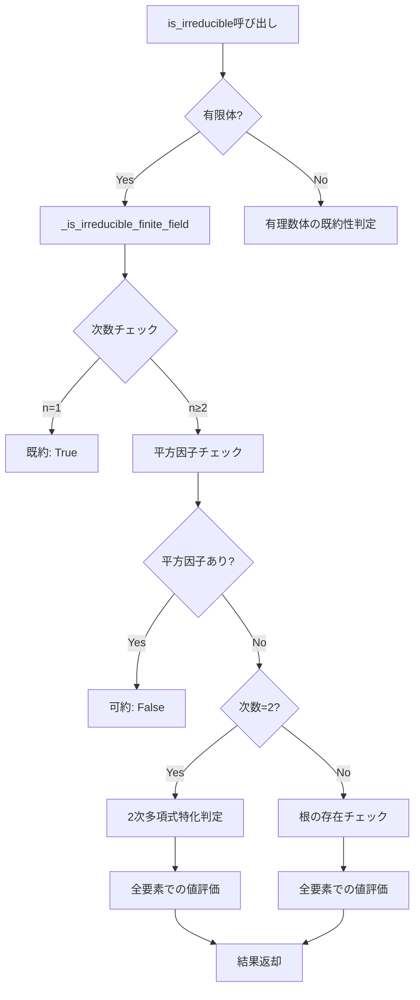

# 有限体上多項式既約性判定 技術仕様書

## 1. 現在の実装アーキテクチャ

### 1.1 クラス構造
```
Polynomial
├── _is_irreducible_finite_field()
├── _is_irreducible_quadratic_finite_field()
├── _has_root_in_finite_field()
└── evaluate() (有限体対応)
```

### 1.2 アルゴリズムの流れ


## 2. パフォーマンス特性

### 2.1 現在の計算量
| 操作 | 時間計算量 | 空間計算量 | 適用範囲 |
|------|------------|------------|----------|
| 2次多項式判定 | O(p) | O(1) | 任意の有限体F_p |
| 高次多項式根チェック | O(p × n) | O(1) | 小さなp (<100) |
| evaluate関数 | O(n) | O(1) | 任意の次数n |

### 2.2 ボトルネック分析
- **主要ボトルネック**: 大きな有限体での全要素スキャン
- **メモリ使用量**: 線形（係数配列サイズに比例）
- **スケーラビリティ**: p > 1000で実用性低下

## 3. Rabinの既約性テスト実装仕様

### 3.1 アルゴリズムの概要
```python
def rabin_irreducibility_test(self, error_probability: float = 1e-10) -> bool:
    """
    Rabinの確率的既約性テスト
    
    Algorithm:
    1. f(x)が平方自由であることを確認
    2. gcd(f(x), x^(q^i) - x) = 1 for i = 1,2,...,n/2
    3. x^(q^n) ≡ x (mod f(x))
    
    Time Complexity: O(n³ log q + n² log² q)
    Error Probability: ≤ error_probability
    """
```

### 3.2 実装の詳細設計

#### 3.2.1 前処理段階
```python
def _rabin_preprocessing(self) -> bool:
    """前処理: 基本的な条件チェック"""
    # 1. 平方自由性チェック
    if not self.is_square_free():
        return False
    
    # 2. 次数チェック
    n = self.degree()
    if n <= 1:
        return n == 1
    
    return True
```

#### 3.2.2 主要計算部
```python
def _rabin_main_computation(self, q: int, n: int) -> bool:
    """Rabinテストの主要計算"""
    # Step 1: gcd(f, x^(q^i) - x) = 1 for i=1,...,n/2
    x_power = self._create_x_polynomial()  # x
    
    for i in range(1, n//2 + 1):
        # x^(q^i) を計算
        x_power = self._fast_modular_power(x_power, q, self)
        
        # x^(q^i) - x を計算
        diff = x_power - self._create_x_polynomial()
        
        # gcd計算
        gcd_result = self.gcd(diff)
        if gcd_result.degree() > 0:
            return False
    
    # Step 2: x^(q^n) ≡ x (mod f)
    final_power = self._fast_modular_power(
        self._create_x_polynomial(), q**n, self
    )
    remainder = final_power.mod(self)
    
    return remainder == self._create_x_polynomial()
```

#### 3.2.3 高速冪乗算
```python
def _fast_modular_power(self, base: "Polynomial", 
                       exponent: int, modulus: "Polynomial") -> "Polynomial":
    """高速冪乗算（mod演算付き）"""
    if exponent == 0:
        return Polynomial([1], self.base_ring)
    
    result = Polynomial([1], self.base_ring)
    base = base.mod(modulus)
    
    while exponent > 0:
        if exponent & 1:
            result = (result * base).mod(modulus)
        base = (base * base).mod(modulus)
        exponent >>= 1
    
    return result
```

### 3.3 エラー確率の制御
```python
def _calculate_required_iterations(self, error_prob: float, q: int) -> int:
    """必要な反復回数を計算"""
    import math
    
    # Rabinテストのエラー確率は最大1/2
    # k回反復でエラー確率は(1/2)^k
    k = math.ceil(-math.log2(error_prob))
    
    # 有限体のサイズに応じた調整
    if q < 100:
        k = max(k, 3)  # 最低3回
    
    return k
```

## 4. Berlekamp-Zassenhausアルゴリズム仕様

### 4.1 アルゴリズムの段階
```python
def berlekamp_zassenhaus_factorization(self) -> List["Polynomial"]:
    """
    Berlekamp-Zassenhausアルゴリズム
    
    Phases:
    1. 有限体での因数分解 (Berlekampアルゴリズム)
    2. Henselの持ち上げ
    3. 組み合わせ段階
    4. 係数再構築
    """
```

### 4.2 Berlekampアルゴリズム
```python
def _berlekamp_factorization(self, prime: int) -> List["Polynomial"]:
    """有限体F_p上でのBerlekamp因数分解"""
    # Q行列の構築: Q[i,j] = [x^(ip)]_j mod f(x)
    # Q - I の核空間を計算
    # 核空間の基底から因数を構築
    pass
```

### 4.3 Henselの持ち上げ
```python
def _hensel_lifting(self, factors: List["Polynomial"], 
                   prime: int, precision: int) -> List["Polynomial"]:
    """Henselの持ち上げによる精度向上"""
    # f = g₁ × g₂ × ... × gₖ (mod p)
    # → f = G₁ × G₂ × ... × Gₖ (mod p^m)
    pass
```

## 5. 性能最適化戦略

### 5.1 キャッシュ戦略
```python
from functools import lru_cache
from typing import Tuple

class PolynomialCache:
    """多項式計算結果のキャッシュ"""
    
    def __init__(self, maxsize: int = 1000):
        self.irreducibility_cache = {}
        self.factorization_cache = {}
        self.maxsize = maxsize
    
    def get_irreducibility(self, poly_hash: str) -> Optional[bool]:
        return self.irreducibility_cache.get(poly_hash)
    
    def cache_irreducibility(self, poly_hash: str, result: bool):
        if len(self.irreducibility_cache) >= self.maxsize:
            # LRU削除
            self._evict_lru()
        self.irreducibility_cache[poly_hash] = result
```

### 5.2 並列化実装
```python
import asyncio
from concurrent.futures import ThreadPoolExecutor

async def parallel_irreducibility_test(self) -> bool:
    """複数手法の並列実行"""
    
    async def run_rabin():
        return await asyncio.to_thread(self.rabin_irreducibility_test)
    
    async def run_basic():
        return await asyncio.to_thread(self._basic_irreducibility_test)
    
    # 最初に完了した結果を採用
    done, pending = await asyncio.wait(
        [run_rabin(), run_basic()],
        return_when=asyncio.FIRST_COMPLETED
    )
    
    # 残りのタスクをキャンセル
    for task in pending:
        task.cancel()
    
    return done.pop().result()
```

### 5.3 メモリ効率化
```python
def _memory_efficient_evaluation(self, elements: Iterator[FieldElement]) -> bool:
    """メモリ効率的な評価"""
    # ストリーミング処理でメモリ使用量を抑制
    for element in elements:
        if self.evaluate(element) == self.base_ring.zero():
            return True  # 根が見つかった
    return False
```

## 6. テスト戦略

### 6.1 単体テスト
```python
class TestRabinIrreducibility:
    """Rabinテストの単体テスト"""
    
    def test_known_irreducible_polynomials(self):
        """既知の既約多項式でのテスト"""
        pass
    
    def test_known_reducible_polynomials(self):
        """既知の可約多項式でのテスト"""
        pass
    
    def test_error_probability_bounds(self):
        """エラー確率の境界テスト"""
        pass
```

### 6.2 性能テスト
```python
import time
import matplotlib.pyplot as plt

def benchmark_irreducibility_methods():
    """既約性判定手法のベンチマーク"""
    
    results = {
        'basic': [],
        'rabin': [],
        'berlekamp': []
    }
    
    for degree in range(2, 20):
        for method in results:
            start_time = time.time()
            # テスト実行
            end_time = time.time()
            results[method].append(end_time - start_time)
    
    # 結果の可視化
    plt.plot(results['basic'], label='Basic')
    plt.plot(results['rabin'], label='Rabin')
    plt.plot(results['berlekamp'], label='Berlekamp')
    plt.legend()
    plt.show()
```

### 6.3 正確性検証
```python
def cross_validate_irreducibility(poly: Polynomial) -> bool:
    """複数手法による結果の交差検証"""
    
    methods = [
        poly.basic_irreducibility_test,
        poly.rabin_irreducibility_test,
        poly.berlekamp_irreducibility_test
    ]
    
    results = []
    for method in methods:
        try:
            result = method()
            results.append(result)
        except NotImplementedError:
            continue
    
    # 結果の一致性チェック
    if len(set(results)) > 1:
        raise ValueError(f"既約性判定結果が一致しません: {results}")
    
    return results[0] if results else None
```

## 7. 配布とデプロイメント

### 7.1 パッケージ構造
```
galois_theory/
├── polynomials/
│   ├── __init__.py
│   ├── core.py           # 基本クラス
│   ├── irreducibility.py # 既約性判定
│   ├── rabin.py         # Rabinテスト
│   └── berlekamp.py     # Berlekampアルゴリズム
├── fields/
├── tests/
└── docs/
```

### 7.2 依存関係管理
```toml
# pyproject.toml
[tool.poetry.dependencies]
python = "^3.8"
numpy = "^1.21.0"
sympy = "^1.9.0"

[tool.poetry.group.dev.dependencies]
pytest = "^6.2.0"
pytest-benchmark = "^3.4.0"
matplotlib = "^3.5.0"
```

### 7.3 継続的インテグレーション
```yaml
# .github/workflows/test.yml
name: Test Suite
on: [push, pull_request]

jobs:
  test:
    runs-on: ubuntu-latest
    strategy:
      matrix:
        python-version: [3.8, 3.9, "3.10", "3.11"]
    
    steps:
    - uses: actions/checkout@v3
    - name: Set up Python
      uses: actions/setup-python@v3
      with:
        python-version: ${{ matrix.python-version }}
    
    - name: Install dependencies
      run: |
        pip install poetry
        poetry install
    
    - name: Run tests
      run: poetry run pytest --benchmark-skip
    
    - name: Run benchmarks
      run: poetry run pytest --benchmark-only
```

## 8. まとめ

この技術仕様書は、有限体上での多項式既約性判定機能の現在の実装から将来の拡張まで、包括的な技術情報を提供します。実装の優先順位はRabinテスト → 最適化 → Berlekampアルゴリズムの順で進めることを推奨します。 